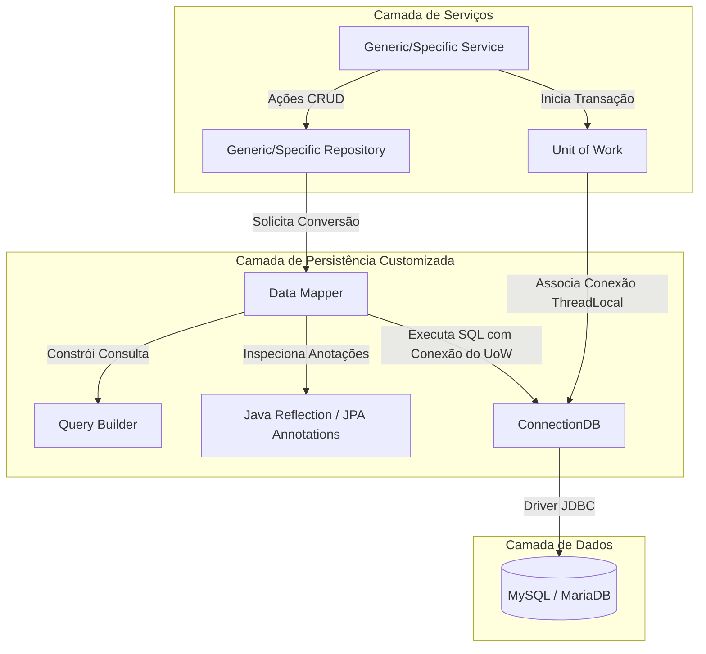

# ADR 0001: Escolha da Pilha Tecnológica e Camada de Persistência JDBC Pura Customizada

* **Status:** `ACEITO`
* **Data:** 2026-07-12
* **Autores/Decisores:** kiruma (Humano), Antigravity (I.A.)

---

## 1. Contexto

Ao iniciar o desenvolvimento do **Projeto Integrador GWJ**, havia a necessidade de selecionar as tecnologias principais para o desenvolvimento da aplicação web dinâmica (back-end, front-end e banco de dados). 

Além disso, enfrentou-se a clássica decisão de arquitetura sobre como interagir com o banco de dados relacional. Em ambientes corporativos, a escolha padrão no ecossistema Spring costuma ser o *Spring Data JPA / Hibernate*. No entanto, para este projeto específico, os objetivos pedagógicos e a busca por performance e controle absoluto sobre o ciclo de vida das conexões e consultas SQL motivaram a busca por uma alternativa.

---

## 2. Decisão

Decidimos adotar a seguinte pilha tecnológica para o desenvolvimento do projeto:

### 2.1. Pilha Tecnológica Core

| Componente | Tecnologia Escolhida | Justificativa |
| :--- | :--- | :--- |
| **Linguagem** | **Java 21** (LTS) | Uso de recursos modernos da linguagem (Pattern Matching, Records, melhorias de desempenho) e garantia de suporte a longo prazo. |
| **Framework Web** | **Spring Boot 3.2.5** | Agilidade na configuração do servidor embutido, injeção de dependências e roteamento HTTP (MVC/Web). |
| **Front-end View** | **Thymeleaf (com Layout Dialect)** | Motor de templates robusto integrado nativamente ao Spring, permitindo renderização no lado do servidor (SSR) e uso do padrão decorador para layouts compartilhados. |
| **Banco de Dados** | **MySQL (MariaDB)** | Banco de dados relacional robusto, estável e amplamente utilizado. |
| **Estilização** | **Vanilla CSS** | Controle absoluto sobre o design visual e micro-animações, evitando frameworks pesados ou pré-processadores desnecessários. |
| **Utilitários** | **Lombok** | Redução do código *boilerplate* (getters, setters, construtores) mantendo o foco nas regras de domínio. |

### 2.2. Camada de Persistência Dinâmica (Sem ORM Comercial)

Optamos por **não utilizar Hibernate, EclipseLink ou Spring Data JPA**. Em substituição, foi desenvolvida uma camada de persistência customizada em **Java (quase) puro**, utilizando:
- **JDBC Tradicional (`java.sql`)**: Para execução de queries e comandos.
- **Java Reflection**: Para inspecionar classes do domínio dinamicamente e mapear propriedades para colunas de banco de dados.
- **Padrão Data Mapper & Query Builder**: Separação de responsabilidades na conversão de entidades em linhas de banco de dados e na construção de instruções SQL baseadas nos metadados do domínio.
- **Unit of Work com `ThreadLocal`**: Gerenciamento transacional acoplado ao ciclo de vida da requisição (Thread), garantindo isolamento e atomicidade (ACID) em operações compostas.

Abaixo, a arquitetura conceitual de persistência desenhada para este fluxo:

---

## 3. Justificativa para a Persistência Customizada

1. **Fins Didáticos (Aprendizado Profundo):** Compreender o que acontece "sob o capô" de frameworks ORM populares (como Hibernate). Desenvolver mecanismos de reflexão, mapeamento de metadados (como `@Column`, `@JoinColumn`) e propagação de conexões via `ThreadLocal` fornece um conhecimento fundamental sobre design de sistemas.
2. **Prevenção de Efeitos Colaterais Clássicos de ORMs:**
   - **Queries N+1:** Ausência de buscas automáticas silenciosas geradas por relacionamentos `@ManyToOne` ou `@ManyToMany` preguiçosos (*lazy loading*).
   - **Overhead de Cache e Estado:** Sem sessão persistente ("dirty checking") de primeiro ou segundo nível que possa consumir memória de forma imprevisível.
3. **Performance Estrita:** Controle total sobre as transações (através do `UnitOfWork`) e geração de SQL otimizada e previsível via `QueryBuilder`.

---

## 4. Consequências

### 4.1. Consequências Positivas
* **Domínio de Infraestrutura:** A equipe ganha pleno entendimento sobre controle transacional, pools de conexão e mapeamento de dados.
* **Leveza do Projeto:** Redução expressiva no número de dependências em runtime e tempo de inicialização acelerado da aplicação.
* **Liberdade de Otimização:** Capacidade de customizar o mapeamento de tipos modernos (como `LocalDate`/`LocalTime`) e relacionamentos sem as restrições impostas por especificações estritas do JPA.

### 4.2. Consequências Negativas / Desafios
* **Carga de Trabalho Adicional:** Toda melhoria arquitetural (como tratamento automático de herança de entidades, validação de schemas ou resolução de relacionamentos muitos-para-muitos complexos) exige código escrito manualmente.
* **Ausência de Otimizações Prontas:** Recursos como paginação genérica otimizada e caches precisam ser programados manualmente quando necessários.
* **Manutenção do Query Builder:** A complexidade do gerador de consultas aumenta conforme novas entidades e relacionamentos complexos são inseridos no domínio.
